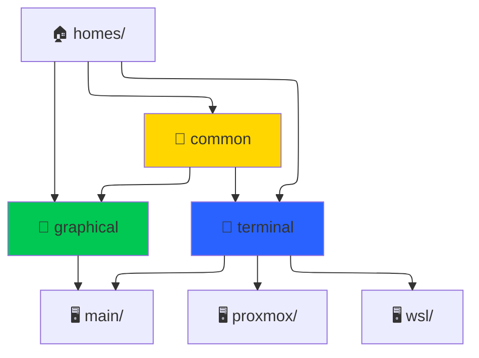

<div align='center'>

</div>

<div align='center'>

# ❄️ NixOS Configuration

*A declarative, reproducible system configuration powered by Nix flakes*

[](https://nixos.org)
[](https://nixos.wiki/wiki/Flakes)
[](https://github.com/nix-community/home-manager)

---

## 🏗️ Overview



</div>

<div align='center'>

## 📂 Project Structure

</div>

```
┌── 🏠 homes/           # Home Manager configurations.
│   ├── 📂 common/        # Configurations shared across all my environments.
│   ├── 📂 graphical/     # Configurations for my user with a graphical environment (GUI)
│   └── 📂 terminal/      # Configurations for my user with a terminal environment (TUI)
├── 🏠 hosts/           # NixOS configurations for my hosts machines.
│   ├── 📂 common/        # Common configurations across all hosts.
│   ├── 📂 main/          # Configuration for my 'main' machine.
│   ├── 📂 wsl/           # Configuration for a WSL environment.
│   └── 📂 proxmox/       # Configuration for my ProxmoxVE host.
├── 💿 iso/             # ISO installer configurations.
├── 📚 lib/             # Library of helper Nix functions.
├── 🚀 remote-install/  # nixos-anywhere deployment tools.
├── 🔧 remote-deploy    # Convenience script for remote deployment.
└── 📜 README.md        # You are here.
```

---
<div align='center'>

**Built with ❄️ NixOS** • **Powered by 🚀 Nix Flakes**

</div>