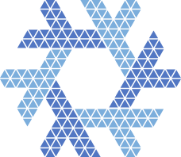
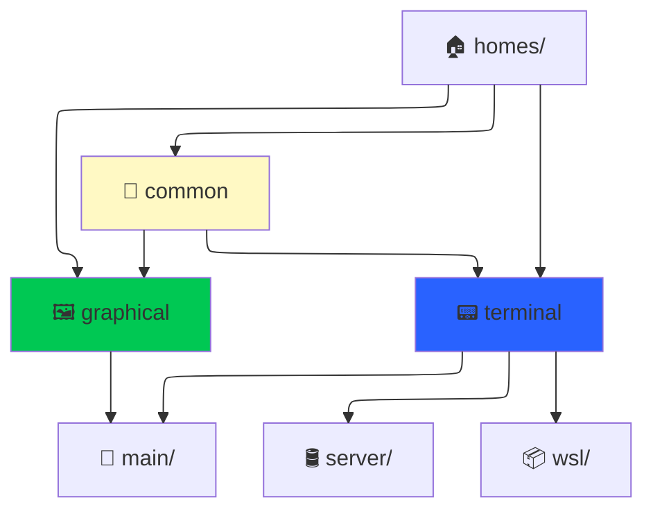

<div align='center'>

</div>

<div align='center'>

# ❄️ NixOS Configuration
[](https://nixos.org)
---

## 🏗️ Overview



</div>

<div align='center'>

## 📂 Project Structure

</div>

```
┌── 🏠 homes/           # HomeManager configurations for my user. (gab)
│   ├── 🤝 common/        # Configurations shared across all my environments.
│   ├── 🖼️ graphical/     # Configurations for my user with a graphical environment (GUI)
│   └── 📟 terminal/      # Configurations for my user with a terminal environment (TUI)
├── 🖥️ hosts/           # NixOS configurations for my machines.
│   ├── 🤝 common/        # Configurations shared across all my hosts.
│   ├── 👑 main/          # Configuration for my main computer.
│   ├── 🛢️ server/        # Configuration for my homelab server.
│   └── 📦 wsl/           # Configuration for my WSL environment.
├── 💿 iso/             # ISO installer configurations.
├── 📚 lib/             # Library of helper Nix functions.
└── 📜 README.md        # You are here.
```

---