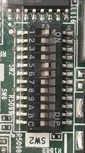

# HPE iLO

I jailbroke my HPE iLO interface on one of my servers (DL360p Gen8), because I added a custom component and
this trips an internal policy of HPE servers which sets the minimal run speed of the **8** onboard fans to 40%.

The custom component is a different RAID controller from the one that was integrated, which allows 'passthrough' HBA to the OS/Hypervisor that I run.
I've disconnected the integrated RAID controller and passed the cable that is connected to the 8-drive backpane to this new RAID controller and then configured it to 'passthrough' all disks.

This new non-HP component basically turned the server into a constant whirring low noise machine. Being that HP left no user facing option to disable this,
people alike to my thinking made a way to [exploit/flash the iLO controller to expose itself via SSH](https://github.com/That-Guy-Jack/HP-ILO-Fan-Control). Additionally, they also add a nice binary called `fan` which lets you edit the fan policies.

**This made it so now it requires the switch 1 on the system maintenance switch of the motherboard to boot into POST**



So at boot of this machine, I need to have either itself (post OS boot) or some other machine that pings the iLO controller after expected boots, and automate the sending of the `fan` commands.

This essentially makes the server run at 40% speeds only for a couple seconds during boot.


Commands I use:

```shell
# old SSH algorithms are needed, which need to be specified when connecting
ssh -oKexAlgorithms=+diffie-hellman-group14-sha1 -oHostKeyAlgorithms=+ssh-rsa root@<SERVER_IP>
# ^ host machine terminal
# v iLO server SSH
# once connected
User:root logged-in to <SERVER_HOSTNAME>.<LOCAL-DOMAIN>.<NAME>(<SERVER_IPV4> / <SERVER_IPV6>)

iLO Advanced 2.73 at  Feb 11 2020
Server Name: <SERVER_NAME>
Server Power: On

</>hpiLO-> 

# typing `fan info` should return data, if no data you need to reset iLO:
reset map1  # this RESTARTS iLO and RESETS fan configuration values, but also the fan binary needed to interface
# <disconnects since iLO restart, reconnect back in when available)
fan info  # returns data

fan pid 01 lo 2000  # set fan 01 to minimum speed of 20%
fan pid 02 lo 2000  # repeat for all fans
# ... wait a bit for the sensors to update and the speed of the fans should slowly fall down to 20%
```