# NixOS

I use NixOS to set up my *nix environments.

I currently have three machines which run nixos derivations:

- [[main]]# My main personal machine
- [[server]]# My homelab server machine
- [[wsl]]# My nixOS set up for a WSL machine (I dual-boot windows)

There is also:
- [[common]] # My nixOS derivation that is added to each host derivation

You can find most of my nixOS code in this notebook.
I've added comments to places I felt we're adequate

- [[lib]]# My nix functions re-used in my derivations
- [[homes]]# My home-manager configurations for my various hosts
- [[flakes]]# My flake-parts derivations

Here's a mermaid diagram trying to describe my current setup:

```mermaid
---
config:
  layout: elk
---
flowchart TB
    A["🏠 homes/"] --> Z["📂 common"]
    Z --> C["📂 graphical"] & D["📂 terminal"]
    C --> G["🖥️ main/"]
    D --> G & I["🖥️ proxmox/"] & H["🖥️ wsl/"]
    style Z fill:#D50000,stroke:#000000
    style C fill:#00C853
    style D fill:#2962FF
```

## Tools

- [Flakegen](https://github.com/jorsn/flakegen) - Flakegen 
- [Flake-parts](https://github.com/hercules-ci/flake-parts) - Flake parts
- [Home Manager](https://github.com/nix-community/home-manager) - Home Manager